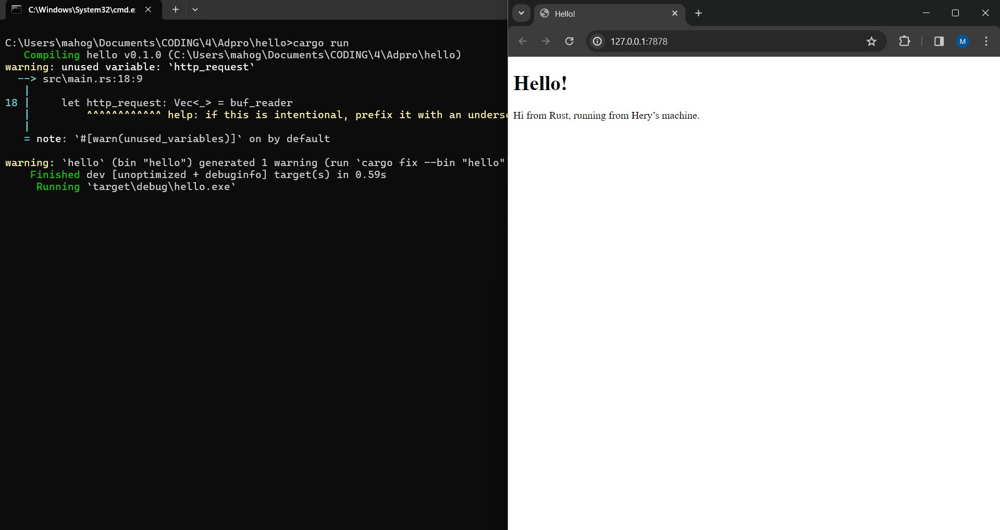

# advprog-modul6

# Mahoga Aribowo Heryasa

# 2206025230

###  Commit 1 Reflection notes

Pada fungsi `main()`, `TCPListener` digunakan untuk membaca koneksi TCP dari server. `TCPListener` mengembalikan kumpulan `Stream` atau koneksi terbuka dari server dan client. Setiap `Stream` yang masuk akan di handle oleh method `handle_connection`. Didalam method tersebut, `BufReader` digunakan untuk membaca data dari `Stream`. Lalu, dengan method `.lines()` data yang dibaca akan dipisahkan per baris berdasarkan kemunculan *newline*. Dengan method `.map` setiap result dari hasil method `.lines()` dipetakan menjadi string dengan memanggil method `.unwrap()`. Kemudian, method `take_while()` akan melakukan *loop* sampai menemukan baris kosong untuk mengambil setiap baris. Terakhir, method `.collect` akan mengumpulkan setiap baris yang telah diambil dan merubah nya menjadi vector yang disimpan pada variabel `http_request`. Hasil `http_request` kemudian di print pada konsol terminal untuk menunjukkan detail request yang diberikan oleh client.

###  Commit 2 Reflection notes

Pada method `handle_connection`, ditambahkan suatu fungsionalitas yang dapat menampilkan template html pada browser klien. baris `let status_line = "HTTP/1.1 200 OK";` digunakan untuk mendefinisikan status *response* HTTP yang akan dikirim sebagai *response* sukses. Kemudian, baris `let contents = fs::read_to_string("hello.html").unwrap();` digunakan untuk membaca konten dari file `hello.html` sebagai string. Selanjutnya, dengan menggunakan method `.len()`, panjang dari konten html yang akan dikirimkan disimpan pada variabel `length`. Terakhir, baris `let response = format!("{status_line}\r\nContent-Length: {length}\r\n\r\n{contents}");` digunakan untuk membangun *response* HTTP yang berisi status line serta header *Content-Length* sekaligus konten dari `hello.html`. Stream kemudian mengirimkan *response* HTTP ini kepada klien dengan perintah `stream.write_all(response.as_bytes()).unwrap()`.  

#### Hasil *screenshot*

