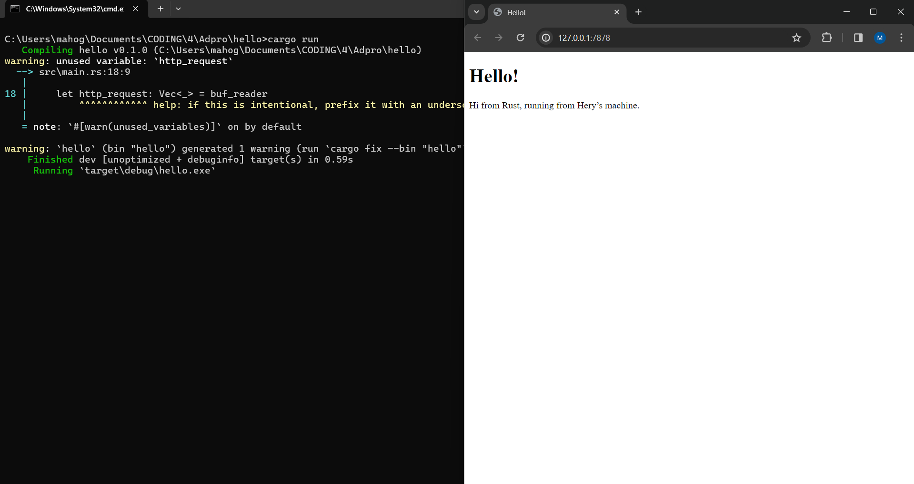
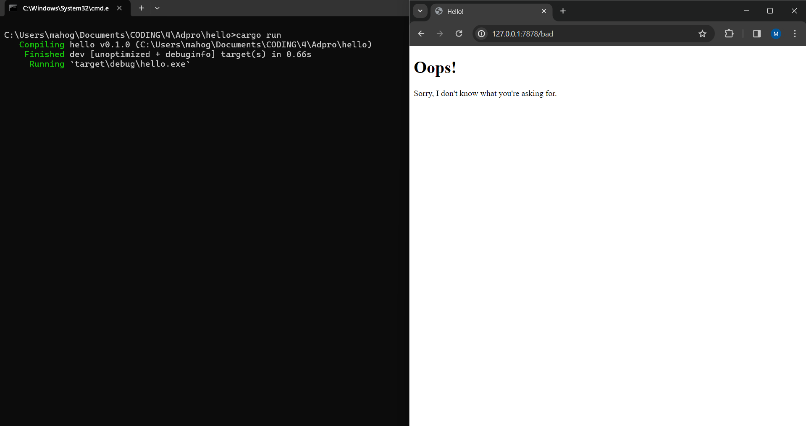

# advprog-modul6

# Mahoga Aribowo Heryasa

# 2206025230

###  Commit 1 Reflection notes

Pada fungsi `main()`, `TCPListener` digunakan untuk membaca koneksi TCP dari server. `TCPListener` mengembalikan kumpulan `Stream` atau koneksi terbuka dari server dan client. Setiap `Stream` yang masuk akan di handle oleh method `handle_connection`. Didalam method tersebut, `BufReader` digunakan untuk membaca data dari `Stream`. Lalu, dengan method `.lines()` data yang dibaca akan dipisahkan per baris berdasarkan kemunculan *newline*. Dengan method `.map` setiap result dari hasil method `.lines()` dipetakan menjadi string dengan memanggil method `.unwrap()`. Kemudian, method `take_while()` akan melakukan *loop* sampai menemukan baris kosong untuk mengambil setiap baris. Terakhir, method `.collect` akan mengumpulkan setiap baris yang telah diambil dan merubah nya menjadi vector yang disimpan pada variabel `http_request`. Hasil `http_request` kemudian di print pada konsol terminal untuk menunjukkan detail request yang diberikan oleh client.

###  Commit 2 Reflection notes

Pada method `handle_connection`, ditambahkan suatu fungsionalitas yang dapat menampilkan template html pada browser klien. baris `let status_line = "HTTP/1.1 200 OK";` digunakan untuk mendefinisikan status *response* HTTP yang akan dikirim sebagai *response* sukses. Kemudian, baris `let contents = fs::read_to_string("hello.html").unwrap();` digunakan untuk membaca konten dari file `hello.html` sebagai string. Selanjutnya, dengan menggunakan method `.len()`, panjang dari konten html yang akan dikirimkan disimpan pada variabel `length`. Terakhir, baris `let response = format!("{status_line}\r\nContent-Length: {length}\r\n\r\n{contents}");` digunakan untuk membangun *response* HTTP yang berisi status line serta header *Content-Length* sekaligus konten dari `hello.html`. Stream kemudian mengirimkan *response* HTTP ini kepada klien dengan perintah `stream.write_all(response.as_bytes()).unwrap()`.  

#### Hasil *screenshot*



###  Commit 3 Reflection notes

Pada tahap ini terdapat beberapa perubahan pada method `handle_connection` untuk memvalidasi request dan *response* HTTP yang bersangkutan. Pertama, request HTTP yang awal mulanya disimpan semua dengan `vector` pada variabel `http_request`, dirubah menjadi `let request_line = buf_reader.lines().next().unwrap().unwrap();` yang berfungsi untuk membaca baris pertama dari request HTTP. Method `.next()` mengambil *item* pertama dari iterator yang dihasilkan method `.lines()` yaitu path yang di request oleh klien, kemudian `.unwrap()` pertama digunakan untuk menangani `Option` ketika tidak ada *items* pada iterator, lalu `.unwrap()` kedua digunakan untuk merubah `Result` menjadi String. Untuk memvalidasi path yang direquest oleh klien, dibuat dua percabangan yang menangani hal tersebut. `if request_line == "GET / HTTP/1.1"` digunakan untuk menangani *request path* yang valid dan akan menjalankan fungsionalitas yang telah dibuat pada *milestone 2*. `else` digunakan untuk menangi *request path* selain `GET / HTTP/1.1` yang tidak valid dan akan memberikan *response* HTTP dengan status `HTTP/1.1 404 NOT FOUND` dan mengembalikan template html `404.html`. 

Terdapat refactoring yang dilakukan pada tahap ini, bagian kode validasi request yang awal mulanya seperti berikut,

```rust
...
    if request_line == "GET / HTTP/1.1" {
        let status_line = "HTTP/1.1 200 OK"; 
        let contents = fs::read_to_string("hello.html").unwrap(); 
        let length = contents.len();
        
        let response =
            format!("{status_line}\r\nContent-Length: {length}\r\n\r\n{contents}");
        
        stream.write_all(response.as_bytes()).unwrap(); 
    } else {
        let status_line = "HTTP/1.1 404 NOT FOUND";
        let contents = fs::read_to_string("404.html").unwrap();
        let length = contents.len();

        let response = format!(
            "{status_line}\r\nContent-Length: {length}\r\n\r\n{contents}"
        );

        stream.write_all(response.as_bytes()).unwrap();
    }    
...
```
Dirubah menjadi seperti berikut,

```rust
    let (status_line, filename) = if request_line == "GET / HTTP/1.1" {
        ("HTTP/1.1 200 OK", "hello.html")
    } else {
        ("HTTP/1.1 404 NOT FOUND", "404.html")
    };

    let contents = fs::read_to_string(filename).unwrap();
    let length = contents.len();

    let response =
        format!("{status_line}\r\nContent-Length: {length}\r\n\r\n{contents}");

    stream.write_all(response.as_bytes()).unwrap();
```

Refactoring ini dilakukan untuk menghilangkan kode yang terduplikasi pada blok `if` dan `else`. Selain itu, kode menjadi lebih ringkas dan pembeda antara *request path* yang valid dan yang tidak valid menjadi lebih jelas, yaitu status *respone* HTTP dan file HTML yang digunakan. 

#### Hasil *screenshot*



###  Commit 4 Reflection notes

Pada tahap ini, untuk mensimulasikan *request* lambat pada server yang sampai tahap ini *single threaded*, dibuatkan opsi *path request* baru `GET /sleep HTTP/1.1` pada percabangan `request_line`. Untuk menangani tiga percabangan, implementasi blok `if else` dirubah menjadi `match` dengan pencocokan `request_line`. Baris `thread::sleep(Duration::from_secs(5));` berfungsi untuk menghentikan eksekusi thread saat ini selama 5 detik, sehingga respons akan terlambat selama 5 detik, dan setelah itu klien akan mendapatkan status *request* serta keluaran HTML yang sama dengan *response* dari *request path* yang valid.

Pada *single threaded* server, ketika terjadi respons lambat seperti yang disimulasikan pada tahap ini, Jika terdapat banyak klien yang melakukan *request* pada saat yang sama, maka server akan menerima setiap *request* secara bergantian, sehingga klien yang membuat *request* baru harus menunggu giliran mereka sampai server selesai menangani *request* dari klien-klien sebelumnya. Hal ini dapat Hal ini dapat menyebabkan peningkatan waktu respon secara signifikan, dan bahkan bisa menyebabkan antrian *request*.